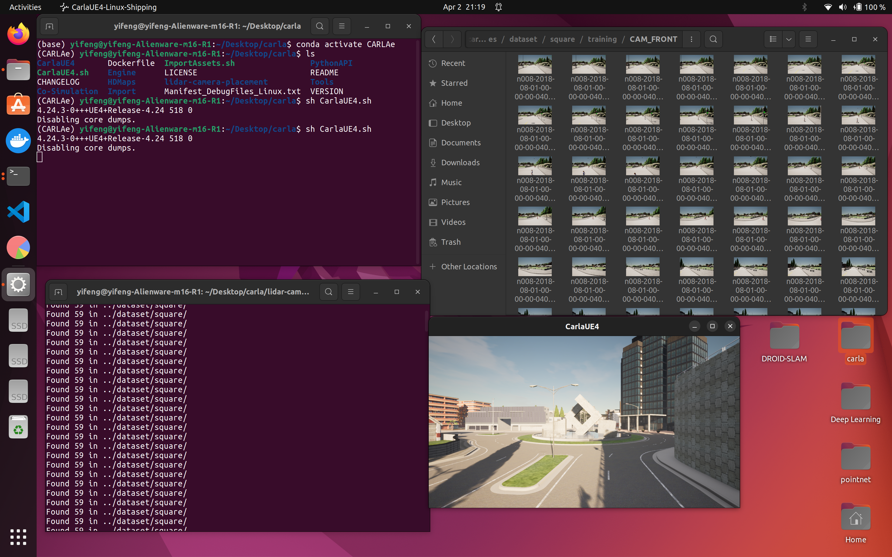
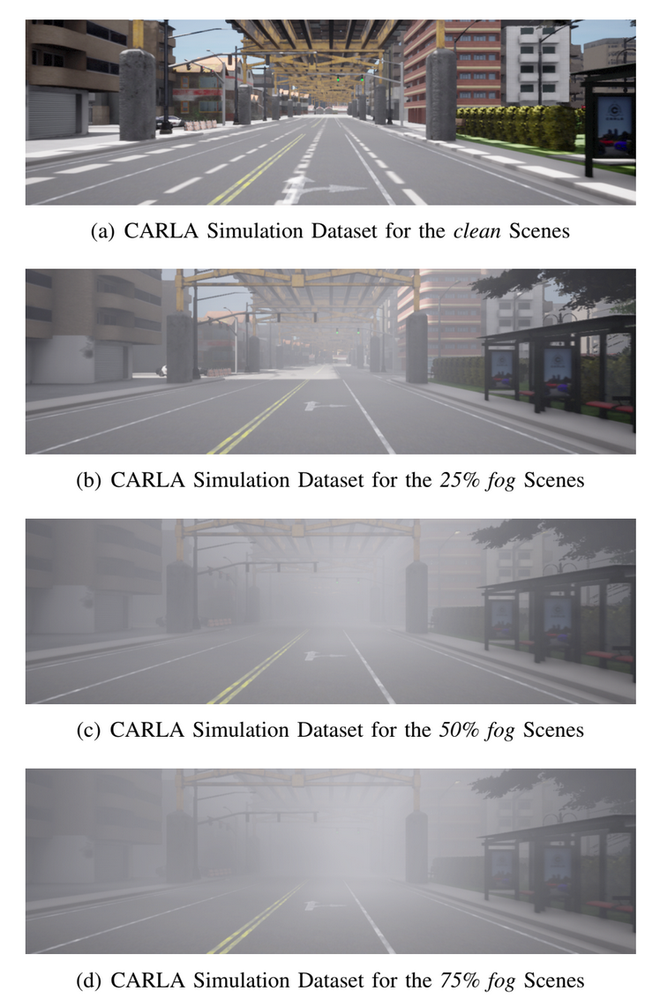

# Introduction
## Dependency
- We tested our project at Ubuntu 20.04 and Ubuntu 22.04LTS
- You can check the configuration file at `deepVO.yml` and you can use `requirements.txt` file to generate conda env
## Real-world KITTI Dataset Preparation & Preprocessing
- Download KITTI real-world dataset at [here](https://www.cvlibs.net/datasets/kitti/)
   - This project used the monocular data from KITTI: please click `Odometry -> the Download odometry data set (color, 65 GB)`, which includes 10 sequences with provided ground truth for training
- Make sure you have downloaded the pose ground truth of the corresponding KITTI dataset sequences


- ## CARLA Synthetic Dataset Generation
- ### Preparation
- Download [CARLA v0.9.10](https://carla-releases.s3.eu-west-3.amazonaws.com/Linux/CARLA_0.9.10.tar.gz) and unzip it under `./carla`. Follow the install instruction of `scenario_runner` of commit [ad71a2c](https://github.com/carla-simulator/scenario_runner/tree/ad71a2c7ed012d735be2b1158fca51b0761ff26b).

- ### Data Collection
- Turn on CARLA as default and then run the following shell script.
- `cd ./carla-nuscenes/scripts`
- `bash routes_baselines.sh`
- LiDAR configurations can be accessed at `./carla-nuscenes/hyperparams`. Camera configurations can be accessed in `./carla-nuscenes/scenario_runner/lidar.py`. The density of Vehicles and Pedestrians can be accessed on `Line 397-422` in `./carla-nuscenes/scenario_runner/srunner/scenarios/route_scenario.py`. The datasets can be accessed at `./carla-nuscenes/dataset`.
- Run the following code to create NuScenes-formatted labels.
- `cp -r ./carla-nuscenes/dataset/[YOUR LIDAR PLACEMENT]/training/label_2 ./NuScenes_generate/label_2`
- `python ./NuScenes_generate/create_test_wide.py`
- `python ./NuScenes_generate/create_trainval_wide.py`
- Copy the folder `./NuScenes_generate/maps`, `./NuScenes_generate/v1.0-trainval` and `./NuScenes_generate/v1.0-test` to your dataset root. Replace the file `splits.py` in the NuScenes-devkit on your environment with our `./NuScenes_generate/splits.py`, otherwise the NuScenes-devkit can not recognize our dataset.

- Then, if you can see the following figures, your dataset is successfully generated 
- 


- ### Format Converter
- This part aims to convert the synthetic dataset to KITTI format, which is based on [nuscenes2kitti](https://github.com/PRBonn/nuscenes2kitti)
- Script usage: 

- ```python3 nuscenes2kitti.py --nuscenes_dir <nuscenes_directory> --output_dir <output_directory>```

- options: 

- `--normalize_remission` set remission values to range `[0,1]`.

- `--mini` compute only for the mini set of scenes.

- `--save_images` save frontal image for each point cloud

- This will create a directory for each scene in `<output_directory>` with the same structure as SemanticKITTI containing:

```
output_directory
└── scene_id
    ├── calib.txt           # dummy file containing just identity transforms
    ├── files_mapping.txt   # original filenames
    ├── labels              # directory containing the panoptic labels
    ├── lidar_tokens.txt    # token for each point cloud
    ├── poses.txt           # pose for each laserscan
    └── velodyne            # directory containing the point clouds
```

### Pretrained Synthetic Dataset Download
- If you feel confused about above tedious setup for generating your own customizable dataset. We provided a pritrained dataset including a variety of conditions, including raining, foggy, and high traffic-flow conditions. You can download here for the [pretyrained dataset](https://drive.google.com/drive/folders/1GWc_3JzKqdBCun9hw0ZAAk10-ay9vUNK)
- Demo Dataset:
- 


      


